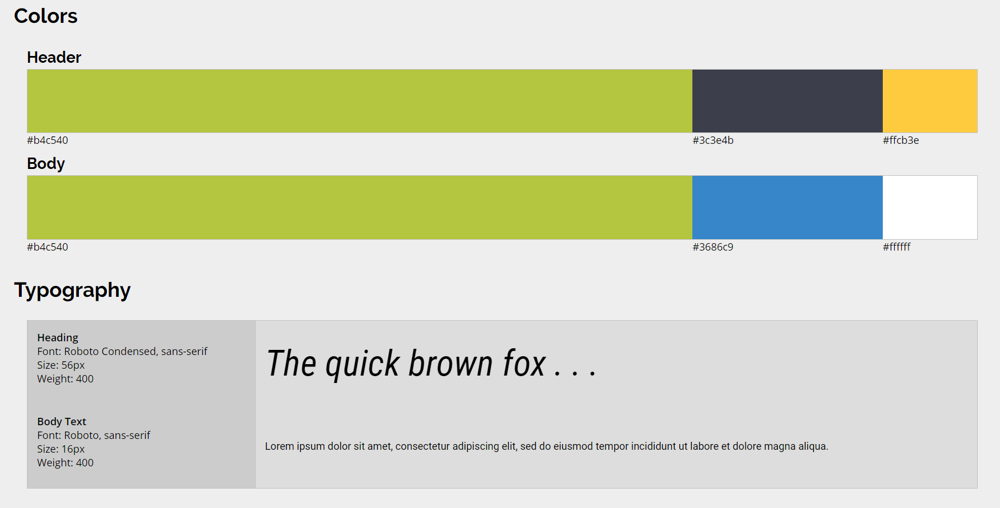

# Local Help SD

### Summary

The vision for this project is to be a place where people who have been affected by COVID-19 can be connected
with members of the community who want to volunteer to help in some way. Those who want to help will be able
to select areas where they can help which will match them with members who need help in those specific areas.
Those who need help will be able to share their stories to help volunteers to relate and empathize with people
on a more individual basis than might be experienced in a broader volunteer experience.

Check below to see screen shots but do note that they very much preliminary and everything is subject to change.

### Technologies

- React - React Hooks - TypeScript - Apollo Client

### Landing Page

### Community Page

Find other users who are looking to help, or for help, depending on if you register as a volunteer or someone seeking help.
Users will be matched by 'help categories'.

### Messaging

Real time messaging via Apollo subscriptions

### Profile

Initial Profile layout, this is still under development and the layout will be changing.

 

### Style Guide

 
